This is a documentation of the tool to semi-automatically allocate river gauges (discharge / water level) onto CaMa-Flood river map, for efficiently perform simulation-observation comparison.

Sample code/data package available on CaMa-Flood webpage.  
<https://hydro.iis.u-tokyo.ac.jp/~yamadai/cama-flood/>

The source code for gauge allocation is also managed as GitHub repository.  
<https://github.com/global-hydrodynamics/AllocRiverGauge>

Note that GitHub repository only contains source code (map data is not included). So we recommend you to use the package downloadable from the webpage.

# Table of Contents

[1. Basic strategy for gauge allocation [2](#basic-strategy-for-gauge-allocation)](#basic-strategy-for-gauge-allocation)

[2. Contents of the package [3](#contents-of-the-package)](#contents-of-the-package)

[2.1 River network maps [3](#river-network-maps)](#river-network-maps)

[High-resolution River Maps [3](#high-resolution-river-maps)](#high-resolution-river-maps)

[Coarse-resolution CaMa-Flood River Maps [4](#coarse-resolution-cama-flood-river-maps)](#coarse-resolution-cama-flood-river-maps)

[2.2 Sample input/allocated data (river gauge list) [4](#sample-inputallocated-data-river-gauge-list)](#sample-inputallocated-data-river-gauge-list)

[GRDC gauges list [4](#grdc-gauges-list)](#grdc-gauges-list)

[GRanD reservoir list [4](#grand-reservoir-list)](#grand-reservoir-list)

[Japan MLIT water level gauge list [5](#japan-mlit-water-level-gauge-list)](#japan-mlit-water-level-gauge-list)

[2.3 Codes for gauge allocation [5](#codes-for-gauge-allocation)](#codes-for-gauge-allocation)

[Codes for \[Step-1\] allocation on high-res river map [5](#codes-for-step-1-allocation-on-high-res-river-map)](#codes-for-step-1-allocation-on-high-res-river-map)

[Codes for \[Step-2\] gauge allocation (map/src/src_param/) [8](#codes-for-step-2-gauge-allocation-mapsrcsrc_param)](#codes-for-step-2-gauge-allocation-mapsrcsrc_param)

[3. Allocation procedure example [13](#allocation-procedure-example)](#allocation-procedure-example)

[Preparation [13](#preparation)](#preparation)

[Example 1: Allocation of GRDC flow gauges [13](#example-1-allocation-of-grdc-flow-gauges)](#example-1-allocation-of-grdc-flow-gauges)

[\[Step-1\] Allocation into high-resolution river map [13](#step-1-allocation-into-high-resolution-river-map)](#step-1-allocation-into-high-resolution-river-map)

[\[Step-2\] Allocation onto CaMa-Flood coarse-resolution river map [21](#step-2-allocation-onto-cama-flood-coarse-resolution-river-map)](#step-2-allocation-onto-cama-flood-coarse-resolution-river-map)

[Example 2: Allocation of GRanD dams [22](#example-2-allocation-of-grand-dams)](#example-2-allocation-of-grand-dams)

[\[Step-1\] Allocation onto high-resolution river map [22](#step-1-allocation-onto-high-resolution-river-map)](#step-1-allocation-onto-high-resolution-river-map)

[\[Step-2\] Allocation onto CaMa-Flood coarse-resolution river map [26](#step-2-allocation-onto-cama-flood-coarse-resolution-river-map-1)](#step-2-allocation-onto-cama-flood-coarse-resolution-river-map-1)

[Example 3: Allocation of Japan MLIT water level gauges [27](#example-3-allocation-of-japan-mlit-water-level-gauges)](#example-3-allocation-of-japan-mlit-water-level-gauges)

[\[Step-1\] Allocation onto high-resolution river map [27](#step-1-allocation-onto-high-resolution-river-map-1)](#step-1-allocation-onto-high-resolution-river-map-1)

[\[Step-2\] Allocation onto CaMa-Flood coarse-resolution river map [30](#step-2-allocation-onto-cama-flood-coarse-resolution-river-map-2)](#step-2-allocation-onto-cama-flood-coarse-resolution-river-map-2)

[4. References [31](#references)](#references)

# Basic strategy for gauge allocation

Allocation of river gauges on model river network (i.e. finding a model grid corresponding to the observation gauge location) is essential for enabling comparison of observed and simulated water level. In order to make a precise and appropriate comparison between the observation and simulation, the gauge allocation should be done in a carefull manner, considering potential errors in gauge attribute information and characteristics of modelled river network.

We assume the information of latitude, longitude and upstream drainage area of river gauges is available hereafter (***Lat, Lon, Uparea***). We want to allocate these river gauges onto the model river network map (especially CaMa-Flood *Yamazaki et al. 2011*) by specifying the corresponding grid ID (***iXX,iYY***), in order to perform model evaluation using observed discharge and water level data.

However, it is complex to directly allocate river gauges onto coarse-resolution river network map, as it’s difficult to find the exact corresponding points on large-size grid boxes. Thus, the basic strategy is for gauge allocation consist of two steps:

- **\[Step-1\] allocate river gauges to high-resolution river map (30sec for global or 5sec for Japan)**

- **\[Step-2\] calculate the corresponding grid on the coarse-resolution river map.**

The high-resolution river maps (Global MERIT Hydro, *Yamazaki et al. 2019;* Japan J-FlwDir, *Yamazaki et al. 2018*) are prepared in this package. Users are expected to first allocate river gauges onto these maps.

Here, we need to assume that there might be:

- \[1\] errors in reported data of each river gauge location (reported lat, lon, uparea)

- \[2\] errors in high-resolution river network map. When these errors exist, river gauges might not be correctly allocated on the river map by automatic algorithm.

Thus, we recommend users to carefully check the automatic allocation results. If there is a suspicious data, please carefully examine the detail. You might need to \[1\] correct the reported info of some gauges, or \[2\] decide not to use the erroneous river gauges. This is why this allocation algorithm is treated as “SEMI-AUTOMATED”.

Once the gauges are allocated on high-resolution river map in \[Step-1\], secondary allocation of these gauges on coarse-resolution river maps can be automatically performed in \[Step-2\]. But please understand that some gauges on small rivers cannot be allocated on CaMa-Flood map, when these small rivers are not represented/resolved.

*Note: the optional code to allocate gauges without drainage area info is also available in this package. More advanced allocation for satellite altimetry gauge AltiMap (Revel et al. 2023) is also developed.*  
*AltiMap:* <https://essd.copernicus.org/articles/16/75/2024/essd-16-75-2024.html>

# Contents of the package

Please download the river gauge allocation package from CaMa-Flood webpage.

*Note: There is GitHub repository for code management, but it does not contain map data.*

## 2.1 River network maps 

High-resolution maps for \[Step-1\] allocation are prepared in hires_map/ directory. Sample coarse-resolution CaMa-Flood maps for \[Step-2\] allocation are also prepared.

### High-resolution River Maps

Two high-resolution river maps (30 sec global map, 5 sec Japan map) are included in ***map_hires/*** directory of the distribution package. Gauges are first allocated to these high-resolution river map in \[Step-1\].

#### (1) hires_map/glb_30sec_pd8_v400/

30 sec global river map, based on MERIT Hydro v1.0. The original MERIT Hydro river map at 3 sec resolution is upscaled to 30 sec using the FLOW upscaling method v4.00 with PreferD8 option (Yamazaki et al. 2009). The upscaled 30 sec map is used in gauge allocation primary for saving computational cost. The baseline MERIT Hydro river map v1.0 is consistent for the high resolution river network data used for CaMa-Flood v4. This map is linked as ***30sec_glb/*** by ***s00-link_map.sh*** script.

*Note that the river network map is prepared in “Flexible Downstream format” (not standard D8 format), so downstream grid does not limit to the eight neighboring grids.*

#### (2) hires_map/jpn_05sec_pd8_v400/

5 sec Japan river map, based on J-FlwDir v1.2, upscaled by FLOW v400 with PreferD8 option. The original J-FlwDir river map at 1 sec resolution is upscaled to 5sec using FLOW method. This map is linked as ***05sec_jpn/*** by ***s00-link_map.sh*** script.

### Coarse-resolution CaMa-Flood River Maps

Gauges first allocated on high-resolution river map are “re-allocated” on coarse-resolution CaMa-Flood river maps to enable observation-model comparison \[Step-2\]. Two sample CaMa-Flood river map is included in ***map/*** directory in the package.

#### (1) map/glb_15min/

Sample 15 min resolution CaMa-Flood global river map. The gauges first allocated on high-resolution river map are RE-allocated on coarse-resolution river map in \[Step-2\].

#### (2) map/tej_01min/

Sample 1 min resolution CaMa-Flood Japan river map.

## 2.2 Sample input/allocated data (river gauge list) 

Some sample river gauge lists are included ***input/*** directory in the package. You can allocate other gauges by preparing the gauge information in the same format as these sample data.

The input data format is “CSV” or “Space-Separated Text”, and the minimum required info is “***ID, Lat, Lon, Uparea***” in 1st to 4th column. Note that there is an alternative code to allocate gauges without Uparea info.

### GRDC gauges list

#### (1) GRDC_original_2019.csv

List of the GRDC gauging stations, with originally reported ***Lat, Lon, Uparea***. This list contains 7564 river gauging stations.

#### (2) GRDC_tmp_modified.csv

List of the GRDC gauging stations, with modified location info (***Lat, Lon, Uparea***). Gauges with modified location is tagged in “Memo” column.

#### (3) GRDC_allocated.csv

List of the GRDC gauging stations allocated on MERIT Hydro river map. The location info of each gauge (***Lat_alloc, Lon_alloc, Uparea_alloc***) is based on MERIT Hydro river map. This data is used for \[Step-2\] allocation on CaMa-Flood coarse-resolution river map.

#### (4) GRDC_QAQC.xlsx

Excel file as a record for the manual QAQC procedure.

### GRanD reservoir list

It’s also possible to allocate reservoirs on the river map. This is required for reservoir operation scheme of CaMa-Flood. We allocated reservoirs in GRanD dataset.

#### (1) GRanD_original_v13GeoDAR.csv

Original GRanD data with modified format for gauge allocation (***ID, Lat, Lon, Uparea***) set to 1st-4th column. This is based on GRanD v1.3 database with some attribute correction by GeoDAR product. (Distributed as GRanD_v13_issues.csv in <https://zenodo.org/records/6163413>)

#### (2) GRanD_tmp_modified.csv

GRanD data with manual attribute correction for appropriate dam allocation.

#### (3) GRanD_allocated.csv

List of the GRanD data allocated on MERIT Hydro river map.

#### (4) GRanD_QAQC.xlsx

Excel file as a record for the manual QAQC procedure.

### Japan MLIT water level gauge list

Sample data for water level gauge allocation. The locations (***Lat, Lon***) for water level gauges managed by Japan MLIT are prepared. These gauges do not have information on upstream drainage area, so they should be allocated using an algorithm which does not require ***Uparea*** attribute.

#### (1) MLIT_original.csv

Original MLIT water level gauge list, containing (***ID, Lat, Lon***) in 1st-3rd column.

#### (2) MLIT_tmp1_modified.csv

Original MLIT water level gauge list with manual attribute correction for appropriate allocation. Some gauges in coastal ports are removed as well.

#### (3) MLIT_allocated.csv

List of the MLIT gauges allocated on J-FlwDir map.

#### (4) MLIT_QAQC.xlsx

Excel file as a record for the manual QAQC procedure.

## 2.3 Codes for gauge allocation

Fortran90 codes for \[Step-1\] allocation on high-resolution river map and \[Step-2\] allocation on coarse-resolution CaMa-Flood river map are included in the package.

The detailed procedure on using these codes with sample input data is shown in Section 3.

### Codes for \[Step-1\] allocation on high-res river map

Fortran90 codes for \[Step-1\] allocating river gauges on high-resolution river map are prepared in ***src/*** directory.

#### (1) src/alloc_gauge_latlon_area.f90

This is the code to allocate gauges with ***Lat, Lon, Uparea*** information on high-resolution river map. The calculation procedure is explained below.

*Note: This code is used for allocating GRDC river gauges and GRanD dams as sample data in this allocation package.*

River gauges listed in the input file can be allocated on 30sec global MERIT Hydro river map by below command (in top directory of the package)

> \`\`\`
>
> ./src/alloc_gauge_latlon_area \$(InputGaugeList) \$(Region)
>
> \`\`\`

***\$(InputFile)*** is input gauge list (Text or CSV file, contains ***ID, Lat, Lon, Uparea*** in 1st – 4th column). ***\$(REGION)*** is option to chose the high-res river map (global30 or japan05).

##### 1a: Input data

List of gauges (***ID, Lat, Lon, Uparea***) is given as input file. Input should be CSV or Space-Separated Text.

##### 1b: Calculate “adjusted errors” of Uparea

When allocating, the balance between the error of upstream catchment area and errors of location (difference between reported and allocated location) is considered.

First, relative error in reported and allocated ***Uparea*** is calculated. The relative error for over-estimation and underestimation has different impact (e.g. 80% overestimation and 80% underestimation should be treated differently), so adjustment is needed for relative error to balance the impact of overestimation and underestimation of ***Uparea***.

For overestimation, the relative error is calculated without any adjustment, and it is given as:

err_adj = (allocated_uparea - reported_uparea) / reported_uparea

For underestimation case, the relative error equivalent to overestimation case is calculated assuming the log-scale over/under estimation has same impact (twice and half are same weight). The underestimation rate is calculated as

rate = (reported_uparea / allocated_uparea)

Then, the corresponding relative error calculated as:

err_adj = α \* (rate-1)

Note that α is a parameter to represent relative importance of overestimation and underestimation. In default, α is set to 0.75 by trials and errors.

*Example: -80% underestimation (1/5 of reported) has same weight as +300% overestimation. (1/5 of reported is equivalent to 5 times of reported 🡪 400% overestimation 🡪 adjusted to 400\*0.75 = 300% overestimation)*

##### 1c: Calculate location error

The geographic distance between reported lat-lon location and allocated lat-lon location is calculated (in km). Then, its relative importance compared to uparea is calculated as:

err_loc = diff_km / min\[ uparea\*\*0.5, 10.0 \]

For example, if uparea is 100km2, 5km error in location is considered to be equivalent to “50% of the square of the basin size”, so ***err_loc*** is calculated as 50%. If uparea is 25km2, 5km error in location is considered to be equivalent to “square of the basin size”, so ***err_loc*** is 100%. Thus, for the same location difference in km, the error is larger in smaller basin.

For river basin larger than 100km2, it is assumed that 10km in location error is equivalent to 100% error in uparea (e.g. 5km location error is 50% uparea error, 12km location error is 120% uparea error).

##### 1d: Gauge allocation

The pixel around the reported lat-lon location are searched within a search radius, and the allocation score (***alloc_score***) is calculated as the sum of the ***err_adj*** (uparea error) and ***err_loc*** (location error). The pixel showing minimum alloc_score is selected as “allocation point”.

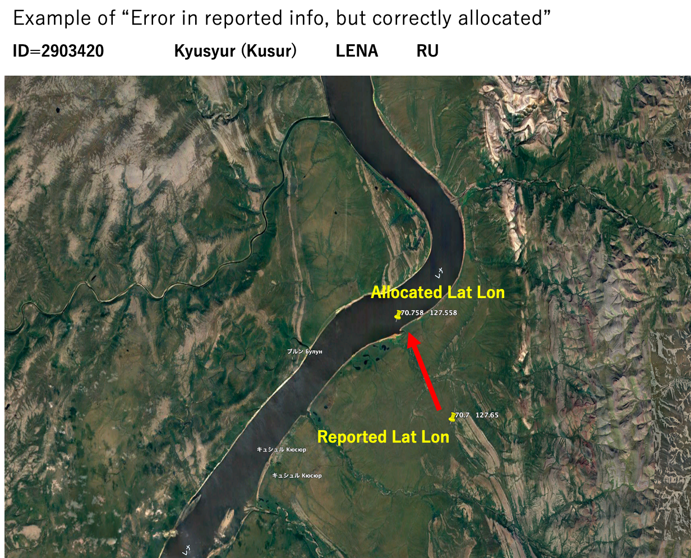

Figure: Example of river gauge allocation.

##### 1e: Output Data

The allocation results (***ID, lat_alloc, lon_alloc, area_alloc***) are outputted together with original (***lat, lon, uparea***), and error info (difference in uparea, relative error in uparea, location difference in km, allocation score) and allocated pixel (***ix,iy***) coordinate of high-resolution river map.

#### \[2\] src/alloc_gauge_latlon_only.f90

Code to allocate gauges with (***Lat,Lon***) information but without ***Uparea*** information.

*Note: This code is used for allocating MLIT water level gauge as sample data in this allocation package.*

The code can be used by the below command (in top directory of the package)

> \`\`\`
>
> ./src/alloc_gauge_latlon_area \$(InputFile) \$(UPATRHS) \$(REGION)
>
> \`\`\`

***\$(InputFile)*** is input gauge list (Text or CSV file, contains ***ID, Lat, Lon*** in 1st – 3rd column). ***\$(UPATHRS)*** is Uparea threshold \[km2\] for stream pixel, on which gauges are allocated. ***\$(REGION)*** is option to chose the high-res river map (global30 or japan05)

##### 2a: Input data

List of gauges (***ID, Lat, Lon***) is given as input file. Input should be CSV or Space-Separated Text.

##### 2b: Find nearest stream from the gauge

The threshold for upstream area \[km2\] is given as the 2nd argument of the code. Pixels with uparea larger than the given threshold is considered as stream.

From each gauge, the nearest stream pixel (in km distance) is searched.

##### 2c: Output data

The allocation results (***ID, lat_alloc, lon_alloc, area_alloc***) are outputted together with original (***lat, lon***), and error info (location difference in km) and allocated pixel (ix,iy) coordinate of high-resolution river map.

### Codes for \[Step-2\] gauge allocation (map/src/src_param/)

Sample code for \[Step-2\] gauge allocation onto 15min CaMa-Flood coarse-resolution river map is also included in the allocation package (***map/src/src_param/***).  
*Note: Step-2 allocation for CaMa-Flood river map is expected to be done in CaMa-Flood package (included in map/src/ directory of CaMa-Flood package). The sample map (glb_15min/ and tej_01min/) is included to explain the procedure of allocation on CaMa-Flood map.*

*Note2: The Step-2 algorithm for allocating gauges on coarse-resolution river maps of other river models (other than CaMa-Flood) should be developed by the model’s developer or user.*

#### (1) map/src/allocate_flow_gauge.F90

This is a code to allocate river gauges with attribute (***ID, Lat, Lon, Uparea***) on CaMa-Flood coarse-resolution river network map.

The code can be used by the below command (in map/your_map/src_param/ directory)

> \`\`\`
>
> allocate_flow_gauge \$(InputFile) \$(option)
>
> \`\`\`

***\$(InputFile)*** is input gauge list (Text or CSV file, contains ***ID, Lat, Lon, Uparea*** in 1st – 4th column). ***\$(option)*** can be multi or single. When “multi” is specified as ***\$(option)***, one flow gauge can be corresponding up to twp upstream grids, while “single” is specified only one upstream grid is corresponded.

The script ***t01-alloc_flow_gauge.sh*** is prepared for easy use of this code with arguments.

##### 1a: Input data

The list of river flow gauges with attribute (***ID, Lat, Lon, Uparea***) is used as input data. It is assumed that the gauges are once allocated on high-resolution river network map, so it is expected that the location attribute (***Lat, Lon, Uparea***) used for Step-2 allocation is based on those of high-resolution river network map (MERIT Hydro or J-FlwDir).

##### 1b: Allocation considering sub-grid gauge location

Based on the location info (***Lat, Lon, Uparea***), this code searches the coarse-resolution grid which corresponds to the river gauges allocated on high-resolution river network map. Here, we consider the three types of correspondence between the coarse-resolution grid and the gauging station, depending on where the gauge exists on the sub-grid-scale river networks within each grid (see figure below).

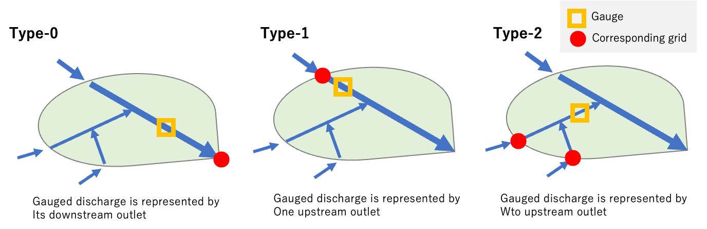

Figure: Types of river flow gauge allocation depending on the sub-grid location of the gauge

- ***Type-0:*** Gauge is on the mainstem nearby the catchment outlet. Gauged flow can be reasonably compared to the modelled discharge at the catchment outlet.

- ***Type-1:*** Gauge is on the stream nearby the upstream edge. One tributary is merging downstream of the gauge. In this case, Gauged flow is better to be compared against the modelled discharge of the upstream grid.

- ***Type-2:*** Gauge is on the tributary, and the tributary has two major upstream tributaries. In this case, gauged flow is better to be compared to the summation of the simulated discharge at two upstream grids.

The code outputs the type of gauge-grid correspondence (***Type=0, 1, or 2***) and the grid-coordination of the corresponding grids. The primary corresponding grid coordinate is saved as \[***ix1,iy1***\], and secondary corresponding grid coordinate is saved as \[***ix2,iy2***\].

The output data contains gauge information below:

- ***ID, Lat, Lon***:

- ***Area_Input, Area_CaMa:*** Uparea in input list, Uparea on CaMa-Flood map

- ***error, diff:*** Uparea error

- ***Type:*** Gauge-grid relation. 0=downstream, 1=single_upstream, 2=dual_upstream

- ***ix1, iy1, area1, ix2, iy2, area2:*** the primary secondary CaMa grids corresponding to gauge.

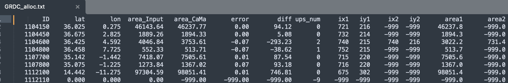

Figure: Example of output file

#### (2) map/src/src_param/allocate_dam.F90

This is a code to allocate dams with attribute (***ID, Lat, Lon, Uparea***) on CaMa-Flood coarse-resolution river network map. The procedure is same as river flow gauges, but “multiple upstream grids” is not considered. Also, this code handles below attributes:

The code can be used by the below command (in map/\$(your_map)/src_param/ directory)

> \`\`\`
>
> allocate_dam \$(InputFile)
>
> \`\`\`

***\$(InputFile)*** is input dam list (Text or CSV file, contains ***ID, Lat, Lon, Uparea*** in 1st – 4th column).

The script ***t02-alloc_dam.sh*** is prepared for easy use of this code with arguments.

##### 2a: Input data

This code is designed to prepare the dam parameters for reservoir operation scheme. The input dam list should contain (ID, Lat, Lon, Uparea) in the 1st ~ 4th column. In addition, following attributes are needed to run the code as 5th ~ 9th column

DamName, RiverName, Reservoir Capacity (million m3), dam elevation, construction year

##### 2b: Dam allocation

The dam allocation on CaMa-Flood river map has two types. \[1\] Dams appropriately allocated on the mainstem of the river network. \[2\] Small dams which cannot be allocated on the mainstem of the grid, and should be treated as sub-grid dam.

##### 2c: Output file

The dams allocated on the unit-catchment mainstem and treated as sub-grid dams are saved separately. (dam_alloc_river.txt, dam_alloc_small.txt). The output file contains:

- ***ID, Lat, Lon***:

- ***Area_Input, Area_CaMa***: Uparea in input list, Uparea on CaMa-Flood map

- ***error, diff:*** Uparea error

- ***ix1, iy1***: CaMa-Flood grids corresponding to gauge.

- ***cap_mcm:*** Reservoir Capacity (million m3)

- ***year:*** Construction Year

- ***damname, rivname***: Name of the dam / Name of River

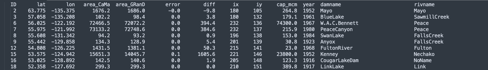

Figure: Sample output dam allocation list

#### (3) map/src/src_param/allocate_level_gauge.F90

This is a code to allocate water level gauge with attribute (***ID, Lat, Lon, Uparea***) on CaMa-Flood coarse-resolution river network map.

The code can be used by the below command (in map/\$(your_map)/src_param/ directory)

> \`\`\`
>
> allocate_level_gauge \$(InputFile)
>
> \`\`\`

***\$(InputFile)*** is input gauge list (Text or CSV file, contains ***ID, Lat, Lon, Uparea*** in 1st – 4th column).

The script ***t03-alloc_level_gauge.sh*** is prepared for easy use of this code with arguments.

##### 3a: Input data

The list of river water level gauges with attribute (***ID, Lat, Lon, Uparea***) is used as input data. It is assumed that the gauges are once allocated on high-resolution river network map, so it is expected that the location attribute (***Lat, Lon, Uparea***) used for Step-2 allocation is based on those of high-resolution river network map (MERIT Hydro or J-FlwDir).

##### 3b: Allocation considering sub-grid gauge allocation

As water level varies within a unit-catchment, water level gauges are allocated on the coarse-resolution river network map with sub-grid location information. Here, we consider the three types of correspondence between the coarse-resolution grid and the gauging station, depending on where the gauge exists on the sub-grid-scale river networks within each grid (see figure below).

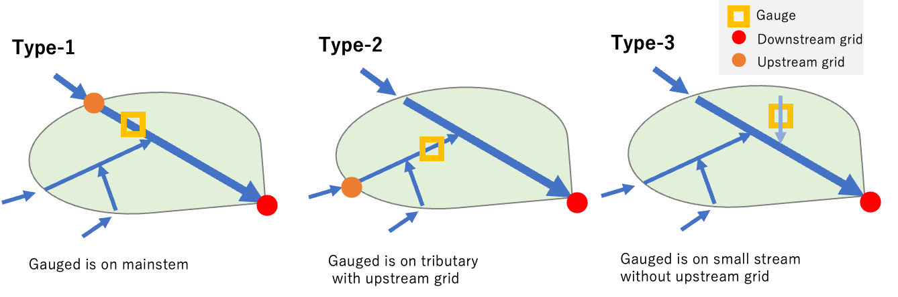

Figure: Types of river flow gauge allocation depending on the sub-grid location of the gauge

- ***Type-1:*** Gauge is on the mainstem of the unit-catchment.

- ***Type-2:*** Gauge is on a tributary of the unit-catchment, with upstream grid

- ***Type-3:*** Gauge is on a small stream without upstream grid. Upstream grid ID cannot be defined.

The sub-grid parameters is calculated to interpolate the simulated water level for comparison with the gauged water level, as show in the below figure.

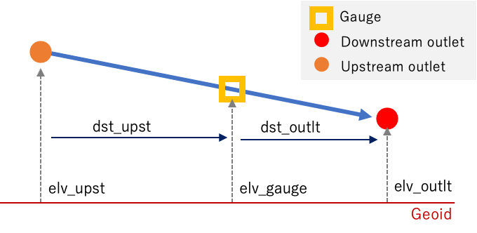

Figure: sub-grid information of the allocated water level gauge.

##### 3c: Output data

The output data contains gauge information below:

- ***ID, Lat, Lon***:

- ***Area:*** Uparea of the gauge location

- ***Type:*** Gauge-grid relation. 1=mainstem, 2=tributary, 3=small stream

- ***ix1, iy1, ix2, iy2:*** the downstream and upstream CaMa-Flood grids corresponding to gauge.

- ***elv_outlt:*** Elevation (above geoid) of the outlet of the unit-catchment where gauge is allocated.

- ***elv_gauge:*** Elevation of the gauge location (based on high-res river network map).

- ***elv_upst:*** Elevation (above geoid) of the outlet of the upstream unit-catchment.

- ***dst_outlt:*** Distance \[km\] to the outlet of the unit-catchment.

- ***dst_upst:*** Distance \[km\] to the outlet of the upstream unit-catchment.

# Allocation procedure example

Procedure for allocating gauges on both high-resolution river map (MERIT Hydro / J-FlwDir) and coarse-resolution river map (CaMa-Flood) are explained, using sample gauge list as an example.

## Preparation

#### (1) Download Package

First, please download the AllocateRiverGauges package from the CaMa-Flood webpage, and place it on your working directory.

<https://hydro.iis.u-tokyo.ac.jp/~yamadai/cama-flood/>

#### (2) Edit adm/Mkinclude

We assume you have Fortran compiler in your environment (gfortran or ifort). Please go to ***adm/*** directory and edit ***Mkinclude*** for your environment.

#### (3) Initial directory set up of the package.

Please execute s00-link_data.sh. The high-resolution maps are linked. Also, code for \[Step-2\] allocation is copied from ***map/src/src_param/*** to coarse-resolution map directory (***map/glb_15min, map/tej_01min***).

## Example 1: Allocation of GRDC flow gauges

Here, the sample procedure for allocating GRDC river flow gauges is explained.

### \[Step-1\] Allocation into high-resolution river map

#### Compile Fortran90 codes in src/ directory.

Go to ***src/*** directory, and compile Fortran90 codes by make command.

> \`\`\`
>
> cd src/
>
> make all
>
> \`\`\`

#### Input data format

Here ***input/GRDC_original_2019Dec.csv*** is used as a sample input.

Make sure that the 1st – 4th column of the import data represents ***ID, Lat, Lon, Uparea***

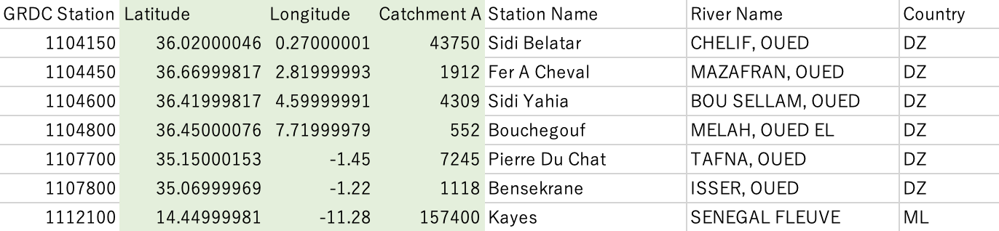

Figure: Example of input data (GRDC_original_2019.csv).

#### Sample allocation procedure in s01-GRDC_DischargeGauge.sh

Gauges are allocated on the river network map, by repeating automatic allocation, manual quality check and visual inspection, and modification of the gauge attributes. Automatic allocation is done by the Fortran90 code ***src/alloc_gauge_latlon_area.f90*** which allocates gauges with (***Lat, Lon, Uparea***) attribute information. Manual quality check and attribute modification is mainly done by Excel file ***input/GRDC_QCQA.xlsx*** using visualization tools such as GoogleEarth and GoogleMap.

The automatic allocation code ***src/alloc_gauge_latlon_area.f90*** finds the pixel on high-resolution river network map which has (Lat, Lon, Uparea) close to the values in the input gauge list. A Region option (global30 or japan05) should be specified when executing. River gauges listed in the input file can be allocated on 30sec global MERIT Hydro river map by below command.

> \`\`\`
>
> ./src/alloc_gauge_latlon_area \$(InputGaugeList) \$(Region)
>
> \`\`\`

The shell script ***s01-GRDC_DischargeGauge.sh*** represent a sample procedure for allocating river discharge gauges. The procedure contains multiple steps.

##### \[Round-1a\] Initial allocation with original location information.

1st round allocation. GRDC gauges are allocated on 30sec global river map using originally reported gauge location attributes.

- Input: ***input/GRDC_original_2019Dec.csv***

- Output: ***output/GRDC_alloc_1st.txt***

##### \[Round-1b\] Initial modification on gauge attribute.

The results of the 1st round allocation are examined, especially focusing on the gauges with large location or uparea errors between the allocated and reported values. The suspicious gauges are visually checked on Google Earth / Google Map, and/or examined by visualizing the uparea data of MERIT Hydro. Based on expert judgement, either the reported attributes are modified or the gauge is excluded from allocation process. The updated gauge list file with modified attribute information is saved, and used as input for the 2nd-round allocation.

- Working File: i***nput/GRDC_QAQC.xlsx (QCQA_1stRound sheet)***

- Updated input gauge list: ***input/GRDC_tmp_modified.csv***

##### \[Round-2a\] Allocation with modified location information.

2nd round allocation. GRDC gauges with modified location information are allocated on 30sec river map.

- Input: ***input/GRDC_tmp_modified.csv***

- Output: ***output/GRDC_alloc_2nd.txt***

##### \[Round-2b\] Quality check the allocation results.

The results of the 2nd round allocation are examined, especially focusing on the gauges with modified location information. It is confirmed that the allocation errors were reduced by changing the location information (Lat, Lon, or Uparea).

Then the reported (Lat, Lon) of the input gauge list is replaced by the allocated (Lat, Lon) on MERIT Hydro. The updated gauge list file with MERIT Hydro Lat Lon info is saved.

- Working File: ***input/GRDC_QAQC.xlsx (QCQA_2ndRound sheet)***

- Updated input gauge list: ***input/GRDC_tmp2_modified.csv***

##### \[Round-3a\] Allocation with MERIT Hydrp location information.

3rd round allocation. GRDC gauges with MERIT Hydro location information (Lat, Lon, Uparea) are allocated on 30sec river map. This is done to minimize the location error due to the bias of in uparea between MERIT Hydro and reported value. The results of this round is used as the finalized allocation.

- Input: ***input/GRDC_tmp2_modified.csv***

- Output: ***output/GRDC_alloc_3rd.txt***

##### \[Round-3b\] Confirm the allocation was done correctly.

The results of the 3rd round allocation are examined. Basically, no additional error is expected.

- Working File: ***input/GRDC_QAQC.xlsx (QCQA_3rdRound sheet)***

##### \[Finalize\] Calculate allocation score.

The error score is calculated between the finalized allocation and original reported attributes. This procedure is to provide the information on allocation error, to support the model-observation comparison.

The score is calculated using the code ***src/check_gauge_latlon_area.f90*** code.

- Input 1: ***output/GRDC_alloc_3rd.txt*** (MERIT Hydro allocated Lat,Lon,Uparea in 2nd – 4th Column)

- Input 2: .***/input/GRDC_tmp_modified.csv*** (Original reported attribute Lat,Lon,Uparea in 5th – 7th Column)

- Output: .***/output/GRDC_alloc_final.txt***

The error score is calculated by the below command.

> \`\`\`
>
> ./src/check_gauge_latlon_area ./output/GRDC_alloc_3rd.txt ./input/GRDC_tmp_modified.csv
>
> \`\`\`

Then, the error score calculation results is examined in the Excel sheet, and the final allocation file with all gauge attribute information is saved (and this is used for \[Step-2\] allocation).

- Working File: ***input/GRDC_QAQC.xlsx (QCQA_Final sheet)***

- Finalized gauge list: ***input/GRDC_allocated.csv***

#### Detail of Round-1a allocation

The original GRDC gauge list ***input/GRDC_original_2019Dec.csv*** is used as input data, and the Round-1 allocated data is saved as output file ***output/GRDC_alloc_1st.txt***. This is done by below commands:

> \`\`\`
>
> ./src/alloc_gauge_latlon_area ./input/GRDC_original_2019Dec.csv global30
>
> mv ./gauge_alloc.txt ./output/GRDC_alloc_1st.txt
>
> \`\`\`

When allocating, the balance between the error of upstream area and errors of location is considered. The output contains below info in addition to allocated and original ***Lat, Lon, Uparea*** attributes.

- ***area_diff:*** Difference of the uparea (km2)

- ***area_error***: Relative error of uparea

- ***loc_km_diff:*** error of location (km)

- ***alloc_score:*** allocation score (0 is best).

- ***ix,iy:*** grid coordinate of high-res river map (1min global or 15sec Japan, Fortran format)

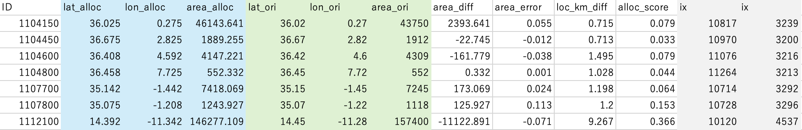

Figure: Example of output data

#### Detail of Round 1b quality check and manual correction

Please carefully check the Round-1a allocation results, and make correction on gauge attributes if needed. The sample Excel file representing correction procedure is included in the package ***GRDC_QAQC.xlsx***.

The Round-1b modification is done in ***QCQA_1stRound*** sheet of the Excel file. Below procedures focusing on allocation score, location error, and uparea error is recommended for quality control.

##### \[Class-1\] Check gauges with alloc_score smaller than 0.5

These gauges (relative error \< 50%) can be considered as reasonably allocated. About 6300 gauges are allocated with score\<0.5. Some gauges have relatively large error in uparea, but these are likely to be caused by the difference of the river network (especially in arid regions with many endorheic basins, or in arctic region with many lakes).

##### \[Class-2\] Check gauges with alloc_score between 0.5 and 1.5

These gauges (relative error between 50% and 150%) can be considered as relatively well allocated. About 600 gauges are allocated with this score range. No correction was made for Class-2 gauges. Please do quality assessment for gauging stations with suspicious data (or stations of your interest) to confirm that allocation is done appropriately.

Sometimes, reported attributes are wrong or not consistent to high-resolution river map, but usually automatic correction works well. (e.g. GRDC ID=1147013, reported location is 15km away from the MERIT Hydro river stream, but correctly allocated)

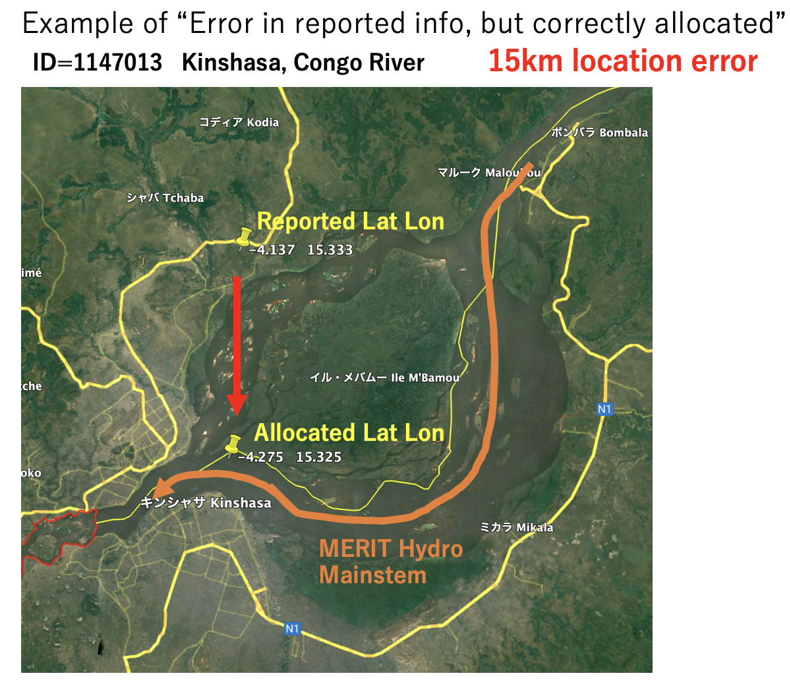

Example of successful automatic allocation.

##### \[Class-3\] Check gauges with alloc_score larger than 1.5

These gauges (relative error \> 150%) can be considered as suspicious allocation. About 200 gauges are allocated with this score range. The attributes of suspicious gauges are better to be corrected if error is found.

The examples of manually corrected gauge attributes are summarized in the supplemental documents ***Supp_GaugeAttributeError.docx***.

First, gauges with more than 10km location errors (about 50 gauges) were checked on GoogleEarth / GoogleMap. Errors are detected by visual inspection & expert judgement. Correction was made when the attribute is obviously wrong. Then, gauges with large uparea error (\>200%, \<-80%) are checked.

##### \[Class-4\] Check gauges which cannot be allocated

Some gauges cannot be allocated on high-resolution river map, because their location data is wrong, or they don’t have uparea info. The attributes of large river gauges are manually examined and corrected.

After careful visual inspection, attribute of 17 GRDC gauges are modified.

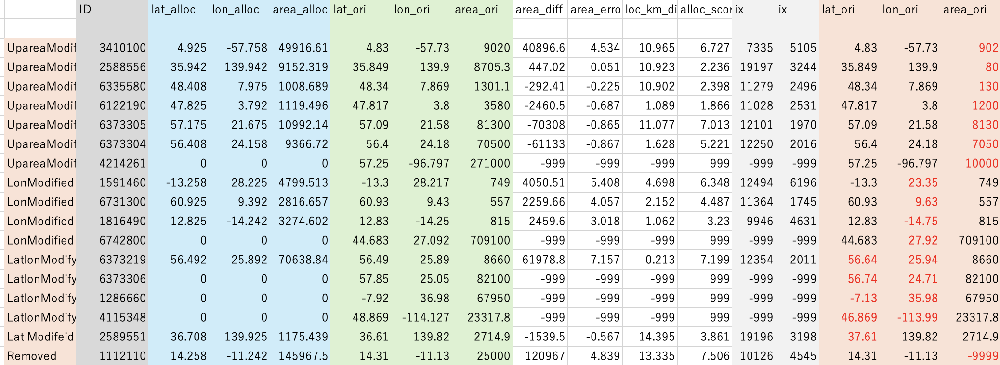

List of GRDC gauges whose attributes are modified.

The GRDC list with modified attributes is saved as ***input/GRDC_tmp_modified.csv***.

#### (6) Detail of Round-2 with modified attribute information

The Round-2 allocation was performed again using the below command (included in s01 script).

> \`\`\`
>
> ./src/alloc_gauge_latlon_area ./input/GRDC_tmp_modified.csv global30
>
> mv ./gauge_alloc.txt ./output/GRDC_alloc_2nd.txt
>
> \`\`\`

The output is saved as ***output/GRDC_alloc_2nd.txt***. Then, copy the output to the ***QCQA_2ndRound*** tab of the excel file, and confirm that the modified gauges are appropriately allocated. Allocation score should be improved.

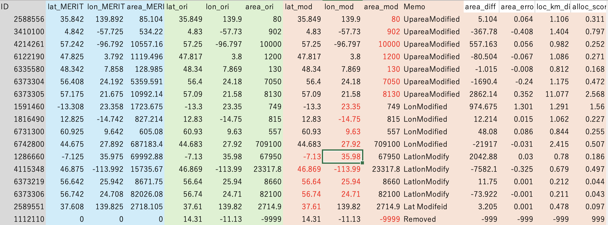

Example of the 2nd round allocation

Then, the reported uparea is replaced with MERIT Hydro based uparea, and make a new input gauge list (***input/GRDC_tmp2_modified.csv***)

#### (7) Detail of Round-3 allocation with MERIT Hydro location information

This step is done to minimize the location shift due to the uparea bias in MERIT Hydro. Again, execute the below command.

> \`\`\`
>
> ./src/alloc_gauge_latlon_area ./input/GRDC_tmp2_modified.csv global30
>
> mv ./gauge_alloc.txt ./output/GRDC_alloc_3rd.txt
>
> \`\`\`

The output is saved as “***output/GRDC_alloc_3rd.txt***”. This output is used as the finalized allocation data.

#### (8) Finalize: calculate allocation error using original allocation data.

Finally, the allocation error is calculated by comparing “allocated (***Lat, Lon, Uparea***) on MERIT Hydro” and “reported (***Lat, Lon, Uparea***) with round-1 modification”. The code ***check_gauge_latlon_area.f90*** is used for this purpose. The allocated attributes are based on ***output/GRDC_alloc_3rd.txt***, and original attributes are based on ***input/GRDC_tmp_modified.csv***.

> \`\`\`
>
> ./src/check_gauge_latlon_area ./output/GRDC_alloc_3rd.txt ./input/GRDC_tmp_modified.csv
>
> mv ./gauge_alloc.txt ./output/GRDC_alloc_final.txt
>
> \`\`\`

The comparison result is saved as ***./output/GRDC_alloc_final.txt.*** Then, copy this data to the ***QAQC_finalized*** sheet. Also, copy the data to “***input/GRDC_allocated.csv***”. This is used for Step-2 allocation on CaMa-Flood coarse-resolution river network map.

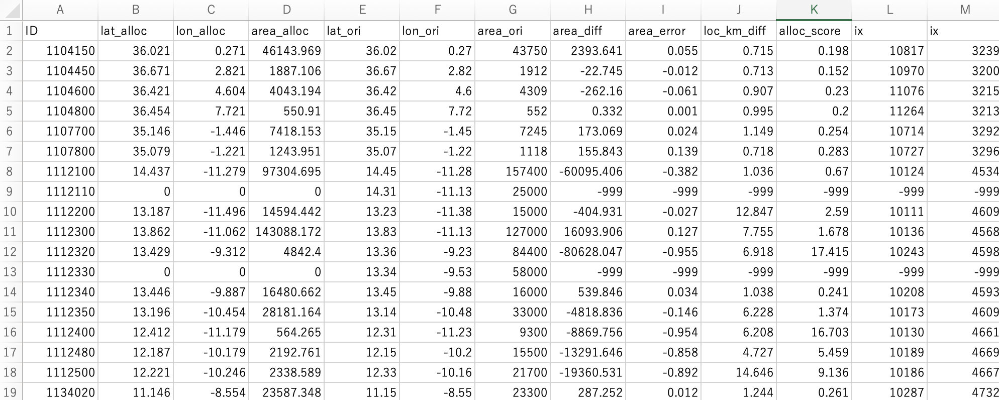

Example of the allocation results (input/GRDC_allocated.csv). To use the data for “Re-allocation” on CaMa-Flood map, the 1st to 4th column should be (ID, Lat, Lon, Uparea) and Lat, Lon, Uparea should be based on high-resolution river network map.

### \[Step-2\] Allocation onto CaMa-Flood coarse-resolution river map

After allocating gauges on high-resolution river network map (MERIT Hydro), please re-allocate these gauges on CaMa-Flood coarse-resolution river map using the sample data and code (***glb_15min/*** in Gauge Allocation package) or the river map you will use in CaMa-Flood package. The procedure on allocating gauges on ***glb_15min/*** river map is explained here.

#### (1) Compile Fortran90 codes in src/ directory.

Go to ***map/glb_15min/src_param/*** directory, and compile Fortran90 codes by make command.

> \`\`\`
>
> cd map/glb_15min/src_param/
>
> make all
>
> \`\`\`

#### (2) edit t01-allocate_flow_gauge.sh script and execute

Please edit ***t01-allocate_glow_gauge.sh*** script and execute. GRDC gauge list allocated on MERIT Hydro (***map/data/GRDC_allocated.csv***) is used as sample input. The allocation result on 15min river map is saved as ***“map/glb_15min/GRDC_alloc.txt”***.

The output data contains gauge information below:

- ***ID, Lat, Lon***:

- ***Area_Input, Area_CaMa***: Uparea in input list, Uparea on CaMa-Flood map

- ***error, diff:*** Uparea error

- ***Type***: Gauge-grid relation. 0=downstream, 1=single_upstream, 2=dual_upstream

- ***ix1, iy1, area1, ix2, iy2, area2:*** the primary secondary CaMa grids corresponding to gauge.

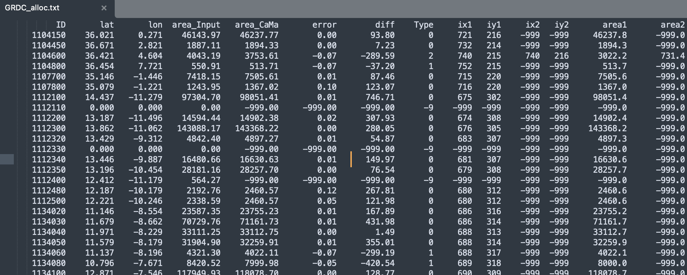

Example of the output GRDC_alloc.txt

## Example 2: Allocation of GRanD dams

Procedure for allocating GRanD dams on both high-resolution river map (MERIT Hydro / J-FlwDir) and coarse-resolution river map (CaMa-Flood) are explained.

### \[Step-1\] Allocation onto high-resolution river map

Step-1 allocation procedure is almost same as GRDC river flow gauge

#### (1) Compile Fortran90 codes in src/ directory.

Go to ***src/*** directory, and compile Fortran90 codes by make command.

> \`\`\`
>
> cd src/
>
> make all
>
> \`\`\`

#### (2) Check input data

Here ***input/GRanC_original_v13GeoDAR.csv*** is used as input.

Make sure that the 1st – 4th column of the import data represents ***ID, Lat, Lon, Uparea***. Some other attributes required for CaMa-Flood reservoir operation routine are included in the file, such as Total Storage, Construction Year.

#### (3) Sample allocation procedure in s02-GRanD_Reservoir.sh.

GRanD dams are allocated on the river network map, by repeating automatic allocation, manual quality check and visual inspection, and modification of the dam attributes. Automatic allocation is done by the Fortran90 code ***src/alloc_gauge_latlon_area.f90*** which allocates gauges with (***Lat, Lon, Uparea***) attribute information. Manual quality check and attribute modification is mainly done by Excel file ***input/GRanD_QCQA.xlsx*** using visualization tools such as GoogleEarth and GoogleMap.

The automatic allocation code ***src/alloc_gauge_latlon_area.f90*** finds the pixel on high-resolution river network map which has (Lat, Lon, Uparea) close to the values in the input dam list. A domain option (global30 or japan05) should be specified when executing. Dams listed in the input file can be allocated on 30sec global MERIT Hydro river map by below command.

> \`\`\`
>
> ./src/alloc_gauge_latlon_area \$(InputGaugeList) \$(DomainOption)
>
> \`\`\`

The shell script ***s02-GRanD_Reservoir.sh*** represent a sample procedure for allocating dams. The procedure contains multiple steps.

##### \[Round-1a\] Initial allocation with original location information.

1st round allocation. GRanD dams are allocated on 30sec global river map using originally reported dam location attributes.

- Input: ***input/GRanD_original_v13GeoDAR.csv***

- Output: ***output/GRanD_alloc_1st.txt***

##### \[Round-1b\] Initial modification on dam attribute.

The results of the 1st round allocation are examined, especially focusing on the dams with large location or uparea errors between the allocated and reported values. The suspicious gauges are visually checked on Google Earth / Google Map, and/or examined by visualizing the uparea data of MERIT Hydro. Based on expert judgement, either the reported attributes are modified or the dam is excluded from allocation process. The updated dam list file with modified attribute information is saved, and used as input for the 2nd-round allocation.

- Working File: i***nput/GRanD_QAQC.xlsx (QCQA_1stRound sheet)***

- Updated input gauge list: ***input/GRanD_tmp_modified.csv***

##### \[Round-2a\] Allocation with modified location information.

2nd round allocation. GRanD dams with modified location information are allocated on 30sec river map.

- Input: ***input/GRanD_tmp_modified.csv***

- Output: ***output/GRanD_alloc_2nd.txt***

##### \[Round-2b\] Quality check the allocation results.

The results of the 2nd round allocation are examined, especially focusing on the dams with modified location information. It is confirmed that the allocation errors were reduced by changing the location information (Lat, Lon, or Uparea).

Then the reported (Lat, Lon) of the input dam list is replaced by the allocated (Lat, Lon) on MERIT Hydro. The updated gauge list file with MERIT Hydro Lat Lon info is saved.

- Working File: ***input/GRanD_QAQC.xlsx (QCQA_2ndRound sheet)***

- Updated input gauge list: ***input/GRanD_tmp2_modified.csv***

##### \[Round-3a\] Allocation with MERIT Hydrp location information.

3rd round allocation. GRanD dams with MERIT Hydro location information (Lat, Lon, Uparea) are allocated on 30sec river map. This is done to minimize the location error due to the bias of in uparea between MERIT Hydro and reported value. The results of this round is used as the finalized allocation.

- Input: ***input/GRanD_tmp2_modified.csv***

- Output: ***output/GRanD_alloc_3rd.txt***

##### \[Round-3b\] Confirm the allocation was done correctly.

The results of the 3rd round allocation are examined. Basically, no additional error is expected.

- Working File: ***input/GRanD_QAQC.xlsx (QCQA_3rdRound sheet)***

##### \[Finalize\] Calculate allocation score.

The error score is calculated between the finalized allocation and original reported attributes. This procedure is to provide the information on allocation error, to support the model-observation comparison.

The score is calculated using the code ***src/check_gauge_latlon_area.f90*** code.

- Input 1: ***output/GRanD_alloc_3rd.txt*** (MERIT Hydro allocated Lat,Lon,Uparea in 2nd – 4th Column)

- Input 2: .***/input/GRanD_tmp_modified.csv*** (Original reported attribute Lat,Lon,Uparea in 5th – 7th Column)

- Output: .***/output/GRanD_alloc_final.txt***

The error score is calculated by the below command.

> \`\`\`
>
> ./src/check_gauge_latlon_area ./output/GRanD_alloc_3rd.txt ./input/GRanD_tmp_modified.csv
>
> \`\`\`

Then, the error score calculation results is examined in the Excel sheet, and the final allocation file with all gauge attribute information is saved (and this is used for \[Step-2\] allocation).

- Working File: ***input/GRanD_QAQC.xlsx (QCQA_Final sheet)***

- Finalized gauge list: ***input/GRanD_allocated.csv***

#### Detail of Round-1a allocation

The original GRanDgauge list ***input/GRanD_original_v13GeoDAR.csv*** is used as input data, and the Round-1 allocated data is saved as output file ***output/GRanD_alloc_1st.txt***. This is done by below commands:

> \`\`\`
>
> ./src/alloc_gauge_latlon_area ./input/GRanD_original_v13GeoDAR global30
>
> mv ./gauge_alloc.txt ./output/GRanD_alloc_1st.txt
>
> \`\`\`

When allocating, the balance between the error of upstream area and errors of location is considered. The output contains below info in addition to allocated and original ***Lat, Lon, Uparea*** attributes.

- ***area_diff:*** Difference of the uparea (km2)

- ***area_error***: Relative error of uparea

- ***loc_km_diff:*** error of location (km)

- ***alloc_score:*** allocation score (0 is best).

- ***ix,iy:*** grid coordinate of high-res river map (1min global or 15sec Japan, Fortran format)

#### (5) Round-1b Quality check and manual correction of dam attributes

Please carefully check the allocation results, and make correction on dam attributes if needed. The sample Excel file representing correction procedure is included in the package “***GRanD_QAQC.xlsx”***. Below procedures focusing on allocation score, location error, and uparea error is recommended for quality control.

After careful visual inspection, attribute of 3 GRanD dams are modified.

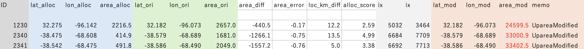

List of GRanD gauges whose attributes are modified.

#### (6) Details of Round-2 allocation with modified attribute information

The dam list with modified attributes is saved as GRanD_tmp_modified.csv. The allocation was performed again using the below command.

> \`\`\`
>
> ./src/alloc_gauge_latlon_area ./input/ GRanD_tmp_modified.csv global30
>
> mv ./gauge_alloc.txt ./output/GRanD_alloc_2nd.txt
>
> \`\`\`

The output is saved as “***output/GRanD_alloc_2nd.txt”***. Then, copy the output to the ***QCQA_2ndRound*** tab of the excel file, and confirm that the modified gauges are appropriately allocated. Allocation score should be improved.

Finally, reported uparea is replaced with MERIT Hydro based uparea, and make a new input gauge list (***input/GRanD_tmp2_modified.csv***)

#### (7) Round-3 allocation with MERIT Hydro location info

Then, the reported uparea is replaced with MERIT Hydro based uparea, and make a new input dam list (***GRanD_tmp2_modified.csv***). This step is done to minimize the location shift due to the uparea bias in MERIT Hydro. Again, execute the command below.

> \`\`\`
>
> ./src/alloc_gauge_latlon_area ./input/ GRanD_tmp2_modified.csv global30
>
> mv ./gauge_alloc.txt ./output/GRanD_alloc_3nd.txt
>
> \`\`\`

The output is saved as “***output/GRanD_alloc_3rd.txt***”. This output is used as the finalized allocation data.

#### (8) Finalize

Please add the MERIT Hydro-based ***Lat, Lon, Uparea*** of the allocated gauges (l***at_MERIT, lon_MERIT, area_MERIT***) to the original GRanD data, and save as CVS file. As a sample allocation results, “***input/GRanD_alloc_full.csv***” is prepared in the package.

Because there are so many attribute data, attributes used for CaMa-Flood reservoir scheme is extracted by the python script (***src/extract_GRanD.py***).

> \`\`\`
>
> python ./src/extract_GRanD.py
>
> \`\`\`

The finalized data is “***input/GRanD_allocated.csv***” and these allocated+extracted attributes are used for Step-2 allocation on CaMa-Flood coarse-resolution river network map.

### \[Step-2\] Allocation onto CaMa-Flood coarse-resolution river map

After allocating dams on high-resolution river network map (MERIT Hydro / J-FlwDir), please re-allocate these gauges on CaMa-Flood coarse-resolution river map using the sample data and code (***map/glb_15min/*** in Gauge Allocation package) or the river map you will use in CaMa-Flood package.

The procedure on allocating gauges on ***glb_15min/*** river map is explained here.

#### (1) Compile Fortran90 codes in src/ directory.

Go to ***map/glb_15min/src_param/*** directory, and compile Fortran90 codes by make command.

> \`\`\`
>
> cd map/glb_15min/src_param/
>
> make all
>
> \`\`\`

#### (2) Edit t02-allocate_dams.sh script and execute.

GRanD gauge list allocated on MERIT Hydro (input/GRanD \_allocated.csv) is used as sample input. The allocation result on 15min river map is saved as “***glb_15min/GRanD_river.txt***” (large dams on mainstem), and “***glb_15min/GRanD_small.txt***” (small sub-grid dams on tributary)

Please execute below commands for allocating GRanD dams on global 15min river map.

> \`\`\`
>
> cd map/glb_15min/src_param/
>
> ./t02-alloc_dams.sh
>
> \`\`\`

The output file contains:

- ***ID, Lat, Lon***:

- ***Area_Input, Area_CaMa:*** Uparea in input list, Uparea on CaMa-Flood map

- ***error, diff:*** Uparea error

- ***ix1, iy1***: CaMa-Flood grids corresponding to gauge.

- ***cap_mcm***: Reservoir Capacity (million m3)

- ***year***: Construction Year

- ***damname, rivname***: Name of the dam / Name of River

## Example 3: Allocation of Japan MLIT water level gauges

Procedure for allocating Japan MLIT water level gauges on both high-resolution river map (MERIT Hydro / J-FlwDir) and coarse-resolution river map (CaMa-Flood) are explained.

### \[Step-1\] Allocation onto high-resolution river map

Step-1 allocation is same as MLIT gauges

#### (1) Compile Fortran90 codes in src/ directory.

Go to ***src/*** directory, and compile Fortran90 codes by make command.

> \`\`\`
>
> cd src/
>
> make all
>
> \`\`\`

#### (2) Check input data

Here ***input/MLIT_original.csv*** is used as input.

Make sure that the 1st – 3rd column of the import data represents ***ID, Lat, Lon***. Uparea info is not available for MLIT water level gauges.

#### (3) Sample allocation procedure in s03-MLIT_LevelGauge.sh.

MLIT water level gauges are allocated on the river network map, by repeating automatic allocation, manual quality check and visual inspection, and modification of the dam attributes. Automatic allocation is done by the Fortran90 code ***src/alloc_gauge_latlon_only.f90*** which allocates gauges with (***Lat, Lon***) attribute information without Uparea. The code ***src/alloc_gauge_latlon_area.f90*** which allocates gauges with (***Lat, Lon, Uparea***) attribute information is also used for Round-2 allocation. Manual quality check and attribute modification is mainly done by Excel file ***input/MLIT_QCQA.xlsx*** using visualization tools such as GoogleEarth and GoogleMap.

The shell script ***s03-MLIT_LevelGauge.sh*** represent a sample procedure for allocating dams. The procedure contains multiple steps.

##### \[Round-1a\] Initial allocation with original location information.

1st round allocation. MLIT gauges are allocated on 05sec japan river map using originally reported dam location attributes.

- Input: ***input/MLIT_original.csv***

- Output: ***output/MLIT_alloc_1st.txt***

##### \[Round-1b\] Initial modification on dam attribute.

The results of the 1st round allocation are examined, especially focusing on the gauges with large location or uparea errors between the allocated and reported values. The suspicious gauges are visually checked on Google Earth / Google Map, and/or examined by visualizing the uparea data of MERIT Hydro. Based on expert judgement, either the reported attributes are modified or the gauges is excluded from allocation process.

The updated dam list file with modified attribute information is saved, and used as input for the 2nd-round allocation.

- Working File: ***input/MLIT_QAQC.xlsx (QCQA_1stRound sheet)***

- Updated input gauge list: ***input/MLIT_tmp_modified.csv***

##### \[Round-2a\] Allocation with modified location information.

2nd round allocation. MLIT gauges with modified location information are allocated on 5sec river map.

- Input: ***input/MLIT_tmp_modified.csv***

- Output: ***output/MLIT_alloc_2nd.txt***

##### \[Finalize\] Quality check the allocation results.

The results of the 2nd round allocation are examined, especially focusing on the dams with modified location information. It is confirmed that the allocation errors were reduced by changing the location information (Lat, Lon, or Uparea). Then, the result is saved as finalized allocation gauge data.

- Working File: ***input/MLIT_QAQC.xlsx (QCQA_2ndRound sheet)***

- Updated input gauge list: ***input/MLIT_allocated.csv***

#### Detail of Round-1a allocation

The original MLIT gauge list ***input/MLIT_original.csv*** is used as input data, and the Round-1 allocated data is saved as output file ***output/MLIT_alloc_1st.txt***. This is done by below commands:

> \`\`\`
>
> ./src/alloc_gauge_latlon_area \$(InputFile) \$(UPATRHS) japan05
>
> mv ./gauge_alloc.txt ./output/MLIT_alloc_1st.txt
>
> \`\`\`

Note that the UPATHRS is uparea threshold to define “stream” \[km2\], and it should be specified as 2nd argument. (set to 1.0 km2 in default)

Level gauges area allocated by finding the nearest stream (whose uparea is larger than the specified threshold) from the reported Lat Lon. The output file contains:

- ***loc_km_diff:*** error of location (km)

- ***ix,iy:*** grid coordinate of high-res river map (1min global or 15sec Japan, Fortran format)

#### (5) Round-1b Quality check and manual correction of dam attributes

Please carefully check the allocation results, and make correction on dam attributes if needed. The sample Excel file representing correction procedure is included in the package “***MLIT_QAQC.xlsx”***. Below procedures focusing on allocation score, location error, and uparea error is recommended for quality control.

Note that MLIT water level gauges contains gauges in coastal ports. These gauges are exluced as they cannot be appropriately allocated on J-Flw Dir. (Excluded using the character 港 or 湾)

After careful visual inspection, attribute of 26 MLIT gauges are removed, and the attribute of 1 gauge is modified.

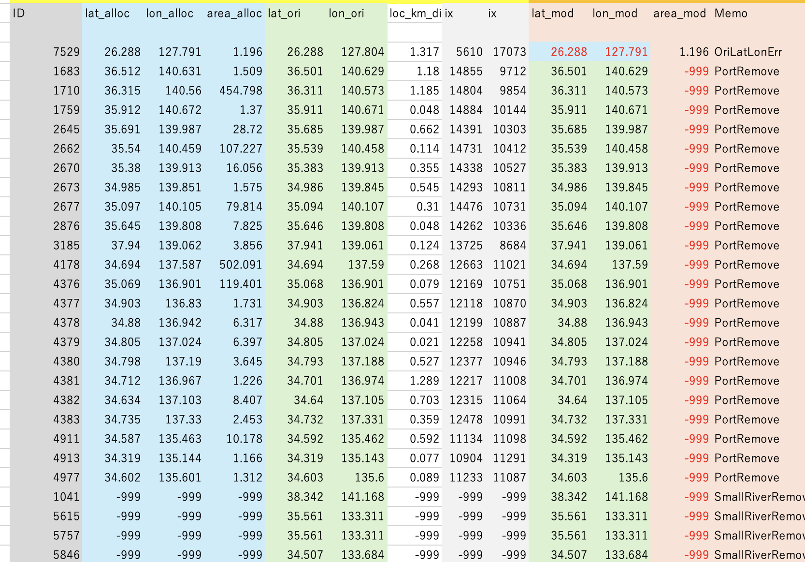

List of MLIT gauges whose attributes are removed or modified.

The updated location attribute is save as ***MLIT_tmo_modified.csv***.

#### (6) Details of Round-2 allocation with modified attribute information

The allocation was performed again using the below command (this time, allocated using Uparea).

> \`\`\`
>
> ./src/alloc_gauge_latlon_area ./input/ MLIT_tmp_modified.csv global30
>
> mv ./gauge_alloc.txt ./output/MLIT_alloc_2nd.txt
>
> \`\`\`

The output is saved as “***output/MLIT_alloc_2nd.txt”***. Then, copy the output to the ***QCQA_2ndRound*** tab of the excel file, and confirm that the modified gauges are appropriately allocated. Allocation score should be improved.

Finally, reported uparea is replaced with MERIT Hydro based uparea, and make a new input gauge list (***input/MLIT_al;located.csv***). This is used as the finalized allocation data.

### \[Step-2\] Allocation onto CaMa-Flood coarse-resolution river map

After allocating gauges on high-resolution river network map (MERIT Hydro / J-FlwDir), please re-allocate these gauges on CaMa-Flood coarse-resolution river map using the sample data and code (***map/tej_01min/*** in Gauge Allocation package) or the river map you will use in CaMa-Flood package. Note that tej_01min stands for River Map at 01min resolution for Today’s Earth – Japan system.

The procedure on allocating gauges on ***tej_01min/*** river map is explained here.

#### (1) Compile Fortran90 codes in src/ directory.

Go to ***map/tej_01min/src_param/*** directory, and compile Fortran90 codes by make command.

> \`\`\`
>
> cd map/tej_01min/src_param/
>
> make all
>
> \`\`\`

#### (2) Edit t03-allocate_level_gauge.sh script and execute.

MLIT gauge list allocated on MERIT Hydro (input/MLIT_allocated.csv) is used as sample input. The allocation result on 15min river map is saved as “***tej_01min/MLIT_levelgauge.txt”***.

Please execute below commands for allocating MLIT gauges on global 15min river map.

> \`\`\`
>
> cd map/tej_01min/src_param/
>
> ./t03-alloc_level_gauge.sh
>
> \`\`\`

The output data contains gauge information below:

- ***ID, Lat, Lon***:

- ***Area:*** Uparea of the gauge location

- ***Type:*** Gauge-grid relation. 1=mainstem, 2=tributary, 3=small stream

- ***ix1, iy1, ix2, iy2:*** the downstream and upstream CaMa-Flood grids corresponding to gauge.

- ***elv_outlt:*** Elevation (above geoid) of the outlet of the unit-catchment where gauge is allocated.

- ***elv_gauge:*** Elevation of the gauge location (based on high-res river network map).

- ***elv_upst:*** Elevation (above geoid) of the outlet of the upstream unit-catchment.

- ***dst_outlt:*** Distance \[km\] to the outlet of the unit-catchment.

- ***dst_upst:*** Distance \[km\] to the outlet of the upstream unit-catchment.

# References

- \<CaMa-Flood\>  
  Yamazaki D., S. Kanae, H. Kim, T. Oki,  
  A physically-based description of floodplain inundation dynamics in a global river routing model  
  Water Resources Research, vol.54, W04501, 2011, DOI 10.1029/2010WR009726  
  <https://doi.org/10.1029/2010WR009726>

- \<FLOW upscaling method\>  
  Yamazaki D., T. Oki, S. Kanae  
  Deriving a global river network map and its sub-grid topographic characteristics from a fine-resolution flow direction map  
  Hydrology and Earth System Sciences, 13(11), 2241-2251, 2009, DOI:10.5194/hess-13-2241-2009  
  <https://doi.org/10.5194/hess-13-2241-2009>

- \<MERIT Hydro\>  
  Yamazaki, D., D. Ikeshima, J. Sosa, P.D. Bates, G.H. Allen, T.M. Pavelsky  
  MERIT Hydro: A high-resolution global hydrography map based on latest topography datasets  
  Water Resources Research, vol.55, pp.5053-5073, 2019, DOI 10.1029/2019WR024873  
  <https://doi.org/10.1029/2019WR024873>

- \<J-FlwDir\>  
  Dai YAMAZAKI, Saeka TOGASHI, Akira TAKESHIMA, Takahiro SAYAMA  
  HIGH-RESOLUTION FLOW DIRECTION MAP OF JAPAN  
  Journal of Japan Society of Civil Engineers, Ser. B1 (Hydraulic Engineering), Vol.74(5), I_163-I_168, 2018, DOI:10.2208/jscejhe.74.5_I_163  
  https://doi.org/10.2208/jscejhe.74.5_I_163

- \<AltiMaP\>  
  Menaka Revel, Xudong Zhou, Prakat Modi, Jean-François Cretaux, Stephane Calmant, Dai Yamazaki  
  AltiMaP: altimetry mapping procedure for hydrography data  
  Earth System Science Data, 16, 75-85, 2024, DOI 10.5194/essd-16-75-2024  
  <https://doi.org/10.5194/essd-16-75-2024>
